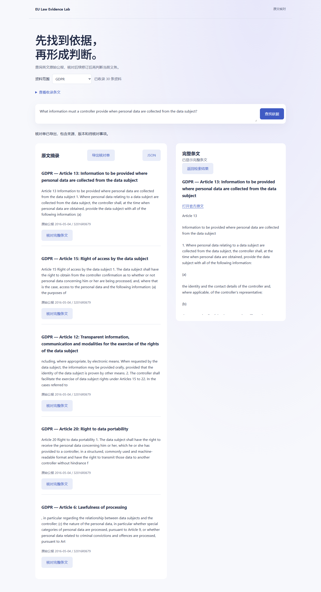

# EU Law Evidence Lab

为研究助理与数据产品团队准备可追溯的法规核对单：选定资料范围，找出相关摘录，打开完整条文，记录版本和仍需确认的问题。

当前支持从欧盟出版局 Cellar 导入 GDPR、DSA、DMA、AI Act 的 **30 条选定原始公报条文**。查询在本机运行，输出原文摘录，不调用付费生成 API。原始公报不是最新合并法规；当前适用性必须另行核验。



## 开始使用

建议独立 CPython 3.10。Windows Conda 3.11 在本机发生 ONNX DLL 初始化失败；不要修改系统 DLL，改用独立 Python 环境。首次下载模型和官方资料需要网络，后续检索离线运行。

```sh
python -m pip install -r knowledge/requirements.txt
python knowledge/import_official.py --output output/official-v1
python knowledge/pipeline.py build --language en --documents output/official-v1/documents.jsonl --index output/official-v1/index.json --cache-dir .cache/models
python knowledge/server.py --language en --index output/official-v1/index.json --cache-dir .cache/models --port 8892
```

打开 `http://127.0.0.1:8892`，选择 GDPR，输入：

> What information must a controller provide when personal data are collected from the data subject?

点击“核对完整条文”查看条件与上下文，然后“导出核对单”。用英文查询；修改问题或范围会清除旧结果。端口只监听本机。数据库可选，默认使用本地文件索引，无需 Docker 或登录。

## 从插件生成核对单

插件包含 `eu-law-rag-agent` 和 `knowledge-indexing` 两个 Skill。前者负责研究问题、证据核对与有引用的宿主综述；后者执行清洗、JSONL、BGE 编码和三路评测。

```sh
python knowledge/research.py --index output/official-v1/index.json --request examples/research-request.json --output output/review-v1 --cache-dir .cache/models
```

输出 `evidence.json` 和 `review.md`。请求与结果的 JSON Schema 见 [schemas](schemas/)。完整原文、模型、向量和运行产物留在本地，不提交 Git。历史关键词演示仍可运行：

```sh
python -m pip install -r requirements-plugin.txt
python scripts/plugin_run.py --input examples/plugin-input.json
```

## 能力与边界

- 官方下载、法规身份核验、条文结构提取、清洗及字符覆盖检查，保留 CELEX、出版日期、采集时间和哈希。
- 本地 BGE small English 384 维向量、BM25 和 RRF；可选 PostgreSQL 全文排名加 pgvector。不同模型或语料隔离。
- 先按法规过滤，再检索；条文去重，完整原文复核；资料不足与版本问题有明确下一步。
- 与原文匹配不足的候选另行折叠，不能冒充支持证据。置信度保留 `unrated`。
- 仅覆盖选定条文，不包含完整法规、判例、国家实施法、关税库、后续修订或自动适用性判断。

[架构与运行手册](knowledge/README.md) | [本轮验收与失败记录](docs/official-source-acceptance.md) | [产品判断与指标](docs/product-case.md) | [开源取舍](docs/open-source.md) | [维护记录](CHANGELOG.md)

## 可选重排实验

`--ranking rerank` 使用固定版本的 MiniLM 对候选片段重排，需要额外下载约 91 MB 权重。默认仍为 `hybrid`：实验在冻结的改写问题中命中 10/16，未达到预设 12/16，且本机热模型中位耗时由约 50 ms 增至 2.67 s。它适合复现实验，不代表更可靠的默认产品。具体取舍、失败题和命令见 [重排实验](docs/reranker-experiment.md)。

本项目不提供法律意见。技术回归与真实用户价值分开记录；目前没有律师标注或真实团队效果数据。

## 分块与引用复核

本轮比较了标题/章节上下文和段落分块。段落方案在已观察的改写题中达到 11/16，但原有问题降至 23/24，未达到默认替换门槛。默认仍为 320 字符正文检索。已修复 350 块中的 65 处空白裁剪位置偏移，并验证正文、向量和 59 题结果不变；导出的摘录保留准确位置和内容哈希。完整结果与复现命令见[分块实验和引用完整性](docs/indexing-experiment.md)。
