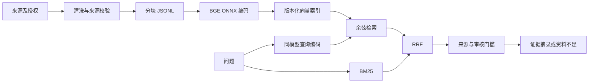

# 可复查的知识库

解决的问题：研究者需要找到能核对的原文，并看见资料不足，而不是得到没有出处的流畅结论。



## 本地运行

Python 3.10 或 3.11，首次运行下载公开模型。文档推理在本机完成，未接入收费 API。以下命令在仓库根目录运行。

```sh
python -m pip install -r knowledge/requirements.txt
python knowledge/pipeline.py build --language en --documents knowledge/examples/documents.jsonl --index output/kb/index.json --cache-dir .cache/models
python knowledge/pipeline.py search --language en --index output/kb/index.json --query "Which information is needed for tariff classification?" --cache-dir .cache/models
python knowledge/pipeline.py evaluate --language en --index output/kb/index.json --cases knowledge/examples/eval.json --cache-dir .cache/models
python knowledge/server.py --language en --index output/kb/index.json --cache-dir .cache/models --port 8781
```

索引输出目录不能已包含同名索引，避免覆盖旧版本。原始资料不修改；模型缓存、向量和运行产物均不提交。

## 模型与契约

默认 `BAAI/bge-small-en-v1.5`，384 维。Token embedding、position embedding、Transformer 编码和池化由预训练 BGE ONNX 模型完成，不自行编造词向量。文档无指令前缀，查询使用模型卡的检索指令，结果归一化。输入保守限制为每块 320 字符、40 字符重叠，避免 512-token 模型截断长资料。章节、页码来自上游提供，不能猜测。部署应增加token长度统计与超限拒绝，不依赖静默截断。

Manifest 记录模型、维数、指令、FastEmbed 版本、chunker 版本、语料哈希和构建时间。切换模型必须完整重建。部署应固定下载模型制品 SHA256；当前本地缓存未作为受信任生产制品发布。

JSONL 保留 source_id、source_title、source_url、retrieved_at、chunk_id、section、page、content_sha256 和 review_status。相同来源的重复段落去重，不合并不同来源的出处。清洗保留否定、数字、表格和换行。`pending` 来源不能进入证据答案。

## 检索与回答

本地模式采用真正 BM25、归一化向量余弦相似度和 RRF（k=60）；中文关键词通道使用确定性二元字组，英文使用词项。没有证据说明它优于成熟中文分词器，后续应使用领域评估选择。

向量最近邻总会返回候选，不能等同有答案。当前证据门槛要求有关键词重合且来源已审核或明确为虚构演示。语义命中但无词项重合仅作为候选，召回可能受限。它是保守可解释基线，不是法律/医疗适用性判定器。相似度不标为置信概率。

默认输出为检索增强的原文摘录，不伪称 LLM 生成。插件宿主可以在证据上生成综述，但每条结论必须带 chunk_id，缺依据时拒答；不得自动执行后续决策。

## 开源取舍

- 实际依赖 [Qdrant FastEmbed](https://github.com/qdrant/fastembed)，Apache-2.0，执行本地 ONNX embedding。
- 实际模型 [BGE](https://github.com/FlagOpen/FlagEmbedding)，MIT。模型许可独立于框架许可。
- 借鉴 [Haystack](https://github.com/deepset-ai/haystack) 的阶段式管线与 DocumentJoiner RRF 边界；未复制代码或声称完整接入框架。
- 可选持久化使用 [pgvector](https://github.com/pgvector/pgvector)，PostgreSQL License。参见 pg_store.py，独立 schema 不混入原有 Gemini 向量空间。

小型虚构 eval 只证明链路可跑，不代表真实专业效果。需要新增真实授权语料、人工标注、不相关问题、时效冲突样本，比较 Recall@k、MRR、拒答准确率、延迟和成本之后才能决定上线。
