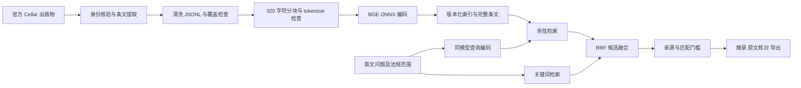

# 可复查的法规知识库

研究者需要找到能核对的原文，并知道资料缺在哪一步。默认链路不依赖数据库或付费 API；可选 PostgreSQL 适合验证持久化与隔离。



## 安装与运行

建议独立 CPython 3.10。本机 Conda 3.11 出现 ONNX DLL 初始化失败，已用独立 3.10 验收。首次运行需要网络下载模型和资料；此后可离线检索本地快照。命令在仓库根目录执行。

```sh
python -m pip install -r knowledge/requirements.txt
python knowledge/import_official.py --output output/official-v1
python knowledge/pipeline.py build --language en --documents output/official-v1/documents.jsonl --index output/official-v1/index.json --cache-dir .cache/models
python knowledge/server.py --language en --index output/official-v1/index.json --cache-dir .cache/models --port 8892
```

打开 http://127.0.0.1:8892 。GDPR、DSA、DMA、AI Act 共 30 条选定原始公报条文，范围固定在 [来源清单](official-sources.json)。界面可展开目录、选法规、查看完整选定条文并导出。不是完整法规库，也不含后续修订、判例或现行适用性审核。

## 导入与结构化

`import_official.py` 使用官方 Cellar 的 XHTML 内容协商接口，只允许官方 HTTPS 主机。校验法规编号、文章 ID；若条文整体非空白文本与提取段落的非空白文本不一致，拒绝导入，避免静默漏掉表格条件。清洗保留否定、数字及段落关系。`coverage.json` 记录 URL、下载哈希、各法规字符数和覆盖率。

每行 JSONL 是一条完整选定条文，保留 source_id、source_title、source_url、retrieved_at、CELEX、publication_date、document_version、review_status。原文与索引仅写入新的 output 子目录。模型缓存和所有全文均不提交 Git。

`source_verified` 只代表官方来源身份与提取检查通过。`pending` 不进入证据；`reviewed` 需要调用者自己的审核依据；`fictional` 只用于测试。来源级别不能证明片段相关性或法律有效性。

## 编码与索引

默认 `BAAI/bge-small-en-v1.5`，384 维。token embedding、position embedding、Transformer 与池化由预训练 ONNX 模型完成。文档无查询前缀；查询使用模型卡的检索指令，向量归一化。

片段上限 320 字符、重叠 40 字符。真实 tokenizer 在推理前检查每个片段和问题，包含指令与特殊 token；超过 512 token 拒绝，不静默截断。本次 350 块最大 83 token。短片段可能拆开条文条件，因此结果始终提供完整选定条文复核，不能只读摘录。

Manifest 包含模型、维数、指令、FastEmbed 版本、chunker、语料哈希、tokenizer 哈希和构建时间。更换模型必须完整重建。本机模型缓存尚未作为固定制品哈希的生产供应链发布。

## 检索和门槛

先按法规过滤候选空间，再检索。文件模式使用 BM25、余弦相似度与 RRF(k=60)。数据库模式使用 PostgreSQL `ts_rank_cd`、pgvector 与 RRF，不把全文排名称作 BM25。不同语料和模型空间隔离，候选排名后按条文去重。

官方摘录需要词项匹配；长查询至少两个不同内容词重合，并在有语义分数时要求余弦不低于 0.6。它是开发集上调整的启发式规则，不是蕴含判定。额外改写测试暴露召回损失；相近候选可展开核对但不当作支持证据。`confidence` 始终为 `unrated`。

结果是原文摘录，不调用 LLM。宿主综述必须逐项引用支持片段；资料不足时明确缺口。原始公报不能回答“目前是否合法”。当前版本提示基于有限词项规则，不能保证识别所有时效类问法。

## 可选 PostgreSQL

准备独立 PostgreSQL 16 和 pgvector 0.8.1，设置 `KB_DATABASE_URL` 后执行相同 server 命令。服务建立自己的表并按语料标识幂等写入。不要指向未经授权的业务库。测试用 `KB_TEST_DATABASE_URL` 指向隔离测试库；不要提交凭据。

```sh
python -m unittest discover -s knowledge -v
python knowledge/accept_official.py --output output/official-v1/http-postgres.json
npm ci
npx playwright install chromium
npm run test:browser
```

HTTP 验收要求 8892 的真实 PostgreSQL 服务；浏览器测试默认也要求数据库模式。文件模式可设置 `EU_LAW_EXPECT_STORAGE=local-json`，非默认端口设置 `EU_LAW_BASE_URL`，报告会保留实际存储类型，不能将文件验收当作数据库验收。网页和 API 共用 loopback 服务，Host/Origin 校验、请求长度限制和 CSP 限制页面能力；这不是多租户生产部署。

## 可选重排实验

默认 `--ranking hybrid` 保持上述流程。显式添加 `--ranking rerank` 会使用固定 revision 的 `Xenova/ms-marco-MiniLM-L-6-v2`，首次需要额外下载约 91 MB ONNX 权重。五个模型制品在启动时校验 SHA256，不校验通过就不启动。

最多 40 个候选进入重排，使用用户所选法规名称和原文邻近上下文。问题与标题、原文合计最多 512 token，实际 tokenizer 检查；上下文最多 1600 字符并保留原文字符位置、原始匹配块与内容哈希。评分是未校准 logit，不是置信度。新 JSON 结果 Schema 为 1.2，附 ranking 元数据；默认仍为 1.1。

```sh
python knowledge/research.py --index output/official-v1/index.json --request examples/research-request.json --output output/review-rerank-v1 --cache-dir .cache/models --ranking rerank
python knowledge/server.py --language en --index output/official-v1/index.json --cache-dir .cache/models --port 8893 --ranking rerank
```

实验尚未达到默认采用门槛，延迟明显增加；完整配对报告、失败题、冻结策略和复现命令见[重排实验](../docs/reranker-experiment.md)。故障不自动降级为其他检索模式。要验收实验数据库服务，可用 `accept_official.py --base http://127.0.0.1:8893`；浏览器测试设置 `EU_LAW_BASE_URL` 为该地址、`EU_LAW_EXPECT_RANKING=hybrid-cross-encoder`。

## 评测与维护

字符分块 v2 修复首部空白裁剪后的位置，片段正文与默认排名不变。返回片段的 `char_start` 与 `char_end` 是清洗后来源的 Unicode 码点半开区间，不是字节或 JavaScript UTF-16 偏移；`content_sha256` 始终对应实际返回文字。超过来源词数预算时保留精确前缀，不重排空白，原片段记录在 `excerpt_of`。正文匹配不到来源或哈希不一致时拒绝生成核对单。旧 v1 索引仅支持可由原窗口证明的空白偏移修正。

`--chunker paragraphs` 和 `--document-context source-section` 是未达默认门槛的实验。前者最多 1200 字符、重叠最多 160；后者只进入向量/BM25/PostgreSQL 全文编码，不写入引用正文。所有文本仍经过真实 512 token 检查。更换策略写新索引，保留旧快照。协议、结果和复现命令见[分块实验](../docs/indexing-experiment.md)。

```sh
python knowledge/evaluate.py --language en --index output/official-v1/index.json --cases knowledge/evaluation/official-cases.json --output output/official-v1/evaluation.json --cache-dir .cache/models --top-k 5 --min-hit-rate 1 --max-false-evidence-rate 0
```

报告不覆盖旧文件。指标不足或分母缺失返回非零。完整本次结果及失败分析见 [官方资料验收](../docs/official-source-acceptance.md)，历史虚构样例见 [检索评测](../docs/retrieval-evaluation.md)。CI 每次重新下载官方条文和真实模型，不以随机向量替代。官网结构变化会阻断发布，需要修复提取器并重查覆盖。
